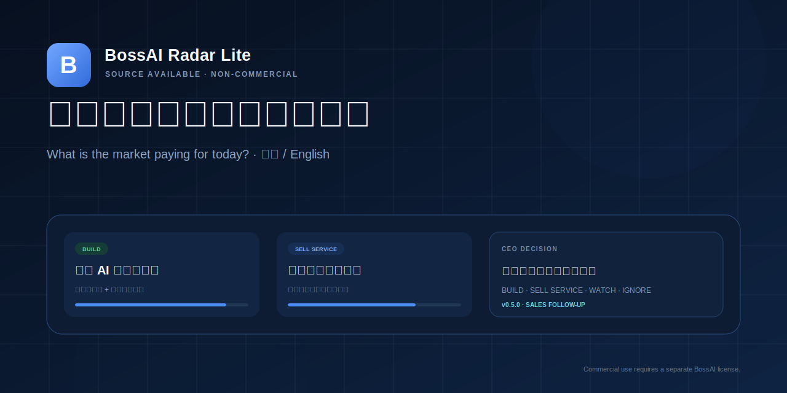

<p align="center">
  
</p>

# BossAI Radar Lite

[中文说明](README.md) · **English**

> Collect public overseas market evidence, identify repeated pain and willingness to pay, and produce an actionable CEO opportunity report.

BossAI Radar Lite is the **source-available, non-commercial edition** of BossAI Radar. It is not a news aggregator and does not require users to manually enter leads.

## Give the Repository Directly to an Agent

Send this URL to OpenClaw, Hermes, Claude Code, or Codex:

```text
https://github.com/liufeng1976/bossai-radar-lite
```

Then instruct the agent:

```text
Read agent-install.json and AGENT_INSTALL.md, then perform the installation, service startup, Skill/MCP registration, and health verification. Keep the installation read-only by default. Do not enable live scans or lead writes without explicit approval.
```

The agent can also run one command:

```powershell
npx -y github:liufeng1976/bossai-radar-lite --agent codex
```

Replace `codex` with `openclaw`, `hermes`, or `claude`. See [Agent Self-Install](AGENT_INSTALL.md).

```text
Public source collection
        ↓
Deduplication, timeouts and source-level failure isolation
        ↓
Pain / payment / competition / urgency scoring
        ↓
Cross-source opportunity clustering
        ↓
BUILD / SELL_SERVICE / WATCH / IGNORE
        ↓
Target customer, offer guidance and a 7-day action plan
```

## Highlights

- Chinese and English dashboard with one-click language switching;
- bilingual commercial-license application and Pro waitlist;
- Chinese and English Markdown report downloads;
- Reddit, Hacker News and GitHub Issues collectors;
- deterministic opportunity scoring that AI cannot override;
- local SQLite evidence store;
- clearly labeled synthetic demo data;
- optional DeepSeek or another OpenAI-compatible model;
- responsive desktop, tablet and mobile UI;
- daily scheduling, run history and source diagnostics;
- Windows one-click launcher;
- GitHub CI and automated tagged releases.

## Why Lite Exists

Lite lets individual developers, researchers and prospective customers evaluate the BossAI Radar method:

- Is every claim traceable to evidence?
- Does popularity represent a real business opportunity?
- Which opportunity should be built now?
- Which opportunity should first be sold as a service?
- Which direction should be watched or explicitly rejected?

It preserves the complete single-machine business-decision loop, but excludes enterprise collaboration, white-label rights, commercial delivery rights and advanced paid data sources.

## Public Evidence Sources

| Source | Integration | Primary Use |
|---|---|---|
| Reddit | Public Search JSON | Complaints, alternatives and willingness to pay |
| Hacker News | Algolia public API | Product discussion and commercialization signals |
| GitHub Issues | GitHub Search API | Feature gaps, integration failures and workflow pain |

Each source has its own timeout, item limit, status and error record. One failed source cannot fail the entire run.

## Deterministic Opportunity Scoring

Each evidence item is scored for:

- pain strength;
- explicit willingness to pay;
- competitor and replacement signals;
- urgency;
- community engagement;
- content completeness.

Opportunity clusters then receive evidence-volume and cross-source validation signals.

```text
BUILD         High score + at least two sources + explicit payment evidence
SELL_SERVICE  Payment evidence exists, but service validation should come first
WATCH         A trend or pain exists, but evidence is incomplete
IGNORE        Do not allocate development resources
```

AI may explain evidence, improve wording and produce action plans. It cannot override the score or decision gate.

## Bilingual Product Experience

Use the language button in the upper-right corner to switch between Chinese and English. The selected language is stored in the browser and carried to:

- the CEO dashboard;
- opportunity and evidence cards;
- run status and scheduler details;
- demo content;
- the commercial-license page;
- the Pro waitlist;
- application email content;
- Markdown report downloads.

English reports are generated from structured opportunity data, not by reusing the Chinese report body.

## Commercial Lead and Sales Pipeline

The commercial application page can save submissions to the local SQLite database while retaining preview, clipboard copy and email backup:

- deterministic lead score with HOT / WARM / COOL priority;
- Pro submissions routed to WAITLIST;
- NEW → QUALIFIED → CONTACTED → PROPOSAL → NEGOTIATION → WON / LOST;
- owner, quote, currency and next-follow-up fields;
- call, email, meeting, quote and note activity history;
- pipeline and won values separated by currency;
- CSV export and permanent deletion of a lead with its activities;
- 24-hour deduplication, submission rate limiting and honeypot filtering.

Open:

```text
http://127.0.0.1:3080/commercial.html?lang=en
http://127.0.0.1:3080/leads.html?lang=en
```

Public deployments must protect the lead workspace with `RADAR_ADMIN_API_KEY`. See the [Commercial Lead Data Notice](docs/LEAD_PRIVACY_EN.md).

## Daily Follow-Up and Sales Actions

v0.5 automatically organizes active leads into four execution queues:

- `OVERDUE`: the planned date has passed;
- `TODAY`: due today;
- `UNSCHEDULED`: active but missing a next follow-up date;
- `UPCOMING`: due within the next seven days.

The system combines due status, HOT / WARM / COOL, sales stage, launch timing and quote presence to rank urgency. It provides:

- due-today and overdue metrics;
- administrative reasons and actions in the current workspace language;
- customer-facing email or message drafts in the lead's language;
- a recommended next stage and next follow-up date;
- one-click copy, local email-client launch and application of the recommended next step;
- Chinese and English Markdown follow-up briefs;
- a 30-day `.ics` calendar export.

The system does not automatically send email, WeChat or SMS. See the [Daily Lead Follow-Up Guide](docs/FOLLOWUP_GUIDE_EN.md).

## Agent Skill, MCP, and GitHub Self-Install

v0.7 lets an Agent complete the entire integration directly from GitHub:

- machine-readable `agent-install.json`;
- root `AGENTS.md` for Codex-compatible agents;
- root `CLAUDE.md` for Claude Code;
- OpenClaw, Hermes, and portable Skills;
- standard stdio MCP server;
- nine default read-only tools and two reusable prompts;
- JSON CLI fallback for hosts without MCP;
- stable install directory, local strong key, background service, and verification;
- service start, stop, restart, and status commands;
- MCP and CLI load `.env` from the Radar installation directory.

The default interface is read-only. Neither MCP nor the CLI exposes lead deletion, and customer outreach remains human-reviewed.

```powershell
npx -y github:liufeng1976/bossai-radar-lite --agent codex
npm run service:status
npm run agent -- overview
```

See [Agent Self-Install](AGENT_INSTALL.md) and the [Agent Skill and MCP Integration Guide](docs/AGENT_INTEGRATION_EN.md).

## Clearly Labeled Demo Data

Click **Load Demo** to create nine synthetic evidence items and three opportunities:

```text
AI Customer Support Copilot          BUILD
Ecommerce Content & Video Assistant SELL_SERVICE
Overseas Intelligence Radar         WATCH
```

Demo constraints:

- every sample has `isDemo=true`;
- the UI displays a `DEMO` badge;
- synthetic records do not expose fake original-post links;
- the demo report is explicitly labeled;
- real scans exclude demo evidence from scoring;
- after a live scan, the current opportunity list contains only live opportunities.

## License Boundary

This project uses the **BossAI Radar Lite Non-Commercial License 1.0**.

Free use includes:

- personal learning;
- academic or non-commercial research;
- internal technical evaluation;
- free non-commercial demonstrations;
- non-commercial modification and redistribution with the copyright and license preserved.

Written commercial authorization is required for:

- paid SaaS, subscriptions or memberships;
- consulting, managed operations, intelligence reports or client delivery;
- paid courses, bootcamps or software bundles;
- internal business use that directly supports revenue;
- white label, OEM, resale or commercial redistribution;
- embedding the project into a commercial product;
- providing it as a paid managed service.

This is a **source-available non-commercial license**, not an OSI-approved open-source license. Visible source code does not grant free commercial-use rights.

Commercial application page:

```text
http://127.0.0.1:3080/commercial.html?lang=en
```

Commercial contact: `liufeng420594566@gmail.com`

Related documents:

- [Full License](LICENSE)
- [Commercial License Guide](docs/COMMERCIAL_LICENSE_EN.md)
- [Lite vs Pro](docs/LITE_VS_PRO_EN.md)
- [Commercial Lead Data Notice](docs/LEAD_PRIVACY_EN.md)

## Technology

- Node.js 22.5+;
- strict TypeScript;
- Express 5;
- Node built-in SQLite;
- native HTML, CSS and JavaScript;
- Model Context Protocol TypeScript SDK;
- Zod tool-input validation;
- optional DeepSeek or another OpenAI-compatible model.

PostgreSQL, Redis and a frontend framework are not required.

## Quick Start

### Windows

Double-click:

```text
start-radar.cmd
```

The script installs dependencies, creates a local `.env` file and opens:

```text
http://127.0.0.1:3080/?lang=en
```

### Command Line

```powershell
cd C:\Users\42059\bossai-radar-lite
npm install
Copy-Item .env.example .env
npm run dev
```

When no historical report exists, the application runs a live scan on startup by default. For an offline or sales demo:

```env
RADAR_AUTO_SCAN=false
RADAR_RUN_ON_STARTUP=false
RADAR_DEMO_ENABLED=true
```

Then start the app and click **Load Demo**.

### Production Verification

```powershell
npm run release:check
npm start
```

### Create Release Packages

```powershell
npm run package:release
```

Artifacts are generated in `release/`:

- Windows ZIP;
- runtime tar.gz;
- SHA256 checksums.

## Optional DeepSeek Integration

```env
AI_PROVIDER=openai-compatible
AI_BASE_URL=https://api.deepseek.com
AI_API_KEY=your-key
AI_MODEL=deepseek-chat
```

Without an AI key, the application continues to work using deterministic business narratives and action templates.

## Main Configuration

```env
PORT=3080
HOST=127.0.0.1
DATA_DIR=./data

RADAR_DEMO_ENABLED=true
COMMERCIAL_LICENSE_EMAIL=liufeng420594566@gmail.com
COMMERCIAL_LICENSE_URL=
COMMERCIAL_LEAD_CAPTURE_ENABLED=true
COMMERCIAL_LEAD_ADMIN_ENABLED=true
COMMERCIAL_LEAD_RATE_LIMIT=5

RADAR_AUTO_SCAN=true
RADAR_RUN_ON_STARTUP=true
RADAR_DAILY_HOUR=8
RADAR_DAILY_MINUTE=0
RADAR_TIMEZONE=Asia/Shanghai
RADAR_LOOKBACK_DAYS=14
RADAR_MAX_ITEMS_PER_SOURCE=20
RADAR_TOPICS=AI ecommerce,Shopify automation,Amazon seller tools,customer support AI,content automation

AI_PROVIDER=deterministic
AI_BASE_URL=https://api.deepseek.com
AI_API_KEY=
AI_MODEL=deepseek-chat

GITHUB_TOKEN=
RADAR_ADMIN_API_KEY=change-this-before-public-deployment

RADAR_API_URL=http://127.0.0.1:3080
RADAR_MCP_LANGUAGE=en
RADAR_MCP_TIMEOUT_MS=20000
RADAR_MCP_ALLOW_SCAN=false
RADAR_MCP_ALLOW_LEAD_WRITE=false
RADAR_SKILL_ALLOW_SCAN=false
RADAR_SKILL_ALLOW_LEAD_WRITE=false
RADAR_LITE_HOME=C:\\Users\\42059\\bossai-radar-lite
```

Before public deployment:

1. replace `RADAR_ADMIN_API_KEY` with a long random value;
2. use an HTTPS reverse proxy;
3. never expose `.env`, `data/`, SQLite files or logs;
4. disable the demo endpoint when it is not needed;
5. comply with every public source's API terms and rate limits;
6. upgrade to a commercial Pro deployment when team permissions, tenant isolation or an SLA are required.

See [SECURITY.md](SECURITY.md).

## API

| Method | Path | Purpose |
|---|---|---|
| GET | `/api/health` | Service, version and license status |
| GET | `/api/overview` | Statistics, schedule and latest report |
| GET | `/api/opportunities` | Opportunity list |
| GET | `/api/evidence` | Evidence list |
| GET | `/api/runs` | Scan history |
| GET | `/api/report/latest` | Latest report JSON |
| GET | `/api/report/latest.md?lang=zh` | Chinese Markdown report |
| GET | `/api/report/latest.md?lang=en` | English Markdown report |
| POST | `/api/scan` | Run a live scan |
| POST | `/api/demo/seed` | Load clearly labeled synthetic demo data |
| POST | `/api/leads` | Submit a commercial-license or Pro-waitlist application |
| GET | `/api/admin/leads` | Search and filter leads as an administrator |
| GET | `/api/admin/leads/stats` | Funnel and per-currency quote statistics |
| GET | `/api/admin/followups?lang=en&days=7` | Get overdue, due-today, unscheduled and upcoming queues |
| GET | `/api/admin/followups/report.md?lang=en` | Download a Chinese or English follow-up brief |
| GET | `/api/admin/followups/calendar.ics` | Download the follow-up calendar |
| GET | `/api/admin/leads/:id/followup-draft` | Generate a lead draft and recommended next step |
| GET | `/api/admin/leads/export.csv` | Export lead data as CSV |
| GET | `/api/admin/leads/:id` | Read a lead and its activity history |
| PATCH | `/api/admin/leads/:id` | Update status, priority, owner, quote and follow-up time |
| POST | `/api/admin/leads/:id/activities` | Add a follow-up activity |
| DELETE | `/api/admin/leads/:id` | Permanently delete a lead and all activities |

Public write requests use:

```http
X-Radar-Key: your-admin-key
```

## Project Layout

```text
bossai-radar-lite/
├── .github/
│   ├── workflows/              # CI and tagged release automation
│   ├── ISSUE_TEMPLATE/
│   └── PULL_REQUEST_TEMPLATE.md
├── docs/
├── integrations/               # MCP configuration examples
├── public/
│   ├── index.html              # bilingual dashboard
│   ├── commercial.html         # bilingual license and Pro application
│   ├── leads.html              # bilingual commercial lead workspace
│   ├── i18n.js                 # Chinese/English dictionary
│   ├── app.js
│   ├── commercial.js
│   └── leads.js
├── skills/                     # portable, OpenClaw, and Hermes skills
├── scripts/
│   ├── i18n-check.mjs
│   ├── install-agent-skill.mjs
│   ├── release-check.mjs
│   └── package-release.mjs
├── src/
│   ├── radar-api-client.ts
│   ├── mcp.ts
│   ├── mcp-server.ts
│   └── agent-cli.ts
├── tests/
├── README.md
└── README_EN.md
```

## Validation

The release gate checks:

- backend tests;
- legacy database migration;
- demo/live evidence isolation;
- lead validation, scoring, deduplication, lifecycle and deletion;
- OVERDUE / TODAY / UNSCHEDULED / UPCOMING queue classification and ordering;
- bilingual customer drafts, recommended stages and next-follow-up dates;
- bilingual follow-up reports and iCalendar export;
- public submission and administrator authorization boundaries;
- MCP tool discovery, prompts, structured calls, and permission gates using the official client;
- JSON CLI subprocess behavior and default denial of scan/write operations;
- portable, OpenClaw, and Hermes SKILL.md frontmatter and safety checks;
- temporary OpenClaw workspace installation;
- machine-readable install manifest and root Agent instructions;
- local npx package-bin execution;
- mutation-free self-install dry-run;
- generated-key secrecy and safe default permissions;
- cross-working-directory `.env` loading;
- background service start, health, status, and stop lifecycle;
- multi-currency pipeline statistics and CSV export;
- English opportunity report generation;
- frontend JavaScript syntax;
- Chinese/English dictionary completeness;
- TypeScript production build;
- required release files;
- version and license consistency.

Run everything with:

```powershell
npm run release:check
```

## Disclaimer

A public post is not a verified order. This project is an opportunity-screening tool, not investment, legal or financial advice. Budget, revenue, customer-count and market-size claims must be verified through the original source.
