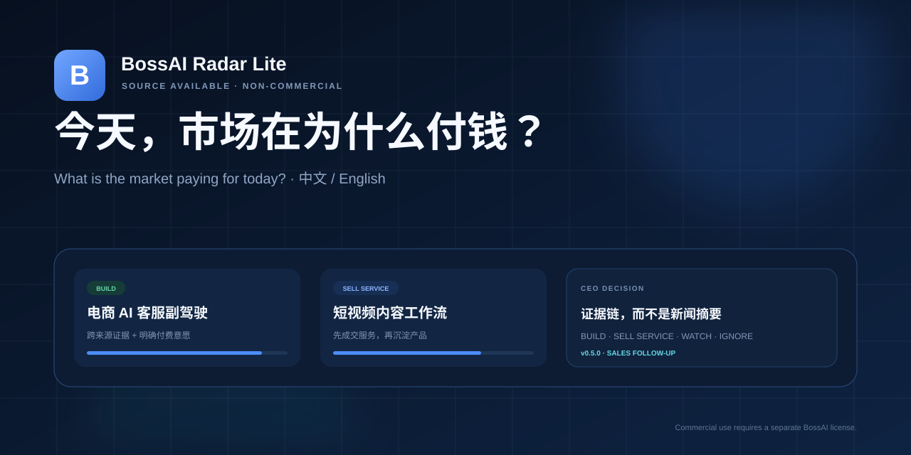

<p align="center">
  
</p>

# BossAI Radar Lite

[中文说明](README.md) · **English**

> Collect public intelligence, compress it into must-read / quick-scan / skip tiers, and continue identifying repeated pain, willingness to pay, and actionable opportunities.

BossAI Radar Lite is the **source-available, non-commercial edition** of BossAI Radar. It is both an installable Agent intelligence Skill and an evidence-backed opportunity validation tool.

## Lite vs commercial BossAI

| Need | Radar Lite | Commercial BossAI / Pro |
|---|---|---|
| Local public-source collection, deterministic scoring and CEO briefs | ✅ | ✅ |
| Agent Skill, local MCP and GitHub self-install | ✅ | ✅ |
| Single-admin local SQLite and human-reviewed lead workflow | ✅ | ✅ |
| Commercial internal use, customer delivery or white-label operation | Separate commercial authorization required | ✅ |
| Team identity, tenant isolation, enterprise data sources, managed hosting/SLA | — | ✅ |
| Persistent Intelligence Employee execution | Delegates through BossAI OS | ✅ governed by BossAI OS |
| Runtime, Approval/Audit, Memory, AI Gateway or Billing authority | Not owned here | BossAI OS / Headquarters Commerce |

See [`docs/LITE_VS_PRO_EN.md`](docs/LITE_VS_PRO_EN.md) for the product split and [`docs/PUBLIC_RELEASE.md`](docs/PUBLIC_RELEASE.md) for the public-release and platform boundary.

### From intelligence to execution

Radar Lite answers “what is worth doing first.” Once evidence is strong enough, pass `top_opportunities` to [BossAI Ecommerce Manager Skill](https://github.com/liufeng1976/bossai-ecommerce-ai-team-skill) for a seven-day execution pack. For order questions, delivery, refund, after-sales or multi-brand support workflows, evaluate [BossAI Customer Service Agent](https://github.com/liufeng1976/bossai-commerce-copilot) for local facts and mandatory human review. None of these repositories duplicates the BossAI OS Runtime.

Before preparing a public release candidate:

```bash
npm run verify:public-release
npm run release:check
```

A passing result is packaging and technical evidence only. It is not proof of public launch, production readiness, commercial validation, or real-user validation.

## Give the Repository Directly to an Agent

Send this URL to OpenClaw, Hermes, Claude Code, or Codex:

```text
https://github.com/liufeng1976/bossai-radar-lite
```

Then instruct the agent:

```text
Read agent-install.json and AGENT_INSTALL.md, then perform the installation, service startup, Skill/MCP registration, and health verification. Keep the installation read-only by default. Do not enable live scans or lead writes without explicit approval.
```

The agent can also run one command:

```powershell
npx -y github:liufeng1976/bossai-radar-lite --agent codex
```

Replace `codex` with `openclaw`, `hermes`, or `claude`. See [Agent Self-Install](AGENT_INSTALL.md).

```text
Public source collection
        ↓
Deduplication, timeouts and source-level failure isolation
        ↓
MUST_READ / QUICK_SCAN / SKIP triage
        ↓
Ready-to-use content ideas
        ↓
Pain / payment / competition / urgency scoring
        ↓
BUILD / SELL_SERVICE / WATCH / IGNORE
        ↓
Target customer, offer guidance and a 7-day action plan
```

## Highlights

- Chinese and English dashboard with one-click language switching;
- bilingual commercial-license application and Pro waitlist;
- Chinese and English Markdown report downloads;
- Reddit, Hacker News, GitHub Issues, ArXiv, and configurable RSS/Atom collectors;
- three-tier daily brief and ready-to-use content ideas;
- deterministic opportunity scoring that AI cannot override;
- local SQLite evidence store;
- clearly labeled synthetic demo data;
- optional DeepSeek or another OpenAI-compatible model;
- responsive desktop, tablet and mobile UI;
- daily scheduling, run history and source diagnostics;
- Windows one-click launcher;
- GitHub CI and automated tagged releases.

## Why Lite Exists

Lite lets individual developers, researchers and prospective customers evaluate the BossAI Radar method:

- Is every claim traceable to evidence?
- Does popularity represent a real business opportunity?
- Which opportunity should be built now?
- Which opportunity should first be sold as a service?
- Which direction should be watched or explicitly rejected?

It preserves the complete single-machine business-decision loop, but excludes enterprise collaboration, white-label rights, commercial delivery rights and advanced paid data sources.

## Public Evidence Sources

| Source | Integration | Primary Use |
|---|---|---|
| Reddit | Public Search JSON | Complaints, alternatives and willingness to pay |
| Hacker News | Algolia public API | Product discussion and commercialization signals |
| GitHub Issues | GitHub Search API | Feature gaps, integration failures and workflow pain |
| ArXiv | Atom API | AI, LLM, Agent, and related research progress |
| RSS / Atom | User-configured public feeds | Industry blogs, product updates, research labs, and vertical media |

Up to 30 RSS feeds can be configured. Each source type has its own timeout, item limit, status and error record. One failed source cannot fail the entire run.

## Reddit/GEO Intelligence Employee Handoff

Opportunity cards now include a **Create Reddit/GEO brief** action. Radar Lite passes selected non-DEMO public evidence to the existing `bossai-intelligence-agent@0.3.0` as bounded `EVIDENCE_JSON` records, preserving the source URL, subreddit, timestamp, engagement, deterministic Radar score, tags and query.

The employee returns `intelligence.reddit-geo-brief.md` with community signals, GEO site-content opportunities, community-rule gaps and a review-gated `bossai.intelligence-handoff.v1`. It does not crawl, post, message users, bulk-reply or mutate Radar data. Radar may enrich up to `RADAR_REDDIT_CONTEXT_COMMUNITIES` observed subreddits during its own authorized scan, caching successful public context for 24 hours and failures for 15 minutes. Downstream drafting stays blocked until rules coverage and identity-disclosure requirements are reviewed.

## Three-Tier Intelligence Brief

Every scan automatically groups findings into:

- **MUST_READ**: explicit payment, strong pain, high urgency, or a high evidence score;
- **QUICK_SCAN**: useful context that does not yet justify immediate action;
- **SKIP**: weak, repetitive, or low-evidence signals.

The report also generates up to six topics that can be converted into articles, short-video scripts, or social posts. Agents should present MUST_READ first, then QUICK_SCAN, and summarize SKIP by count unless details are requested.

## Deterministic Opportunity Scoring

Each evidence item is scored for:

- pain strength;
- explicit willingness to pay;
- competitor and replacement signals;
- urgency;
- community engagement;
- content completeness.

Opportunity clusters then receive evidence-volume and cross-source validation signals.

```text
BUILD         High score + at least two sources + explicit payment evidence
SELL_SERVICE  Payment evidence exists, but service validation should come first
WATCH         A trend or pain exists, but evidence is incomplete
IGNORE        Do not allocate development resources
```

AI may explain evidence, improve wording and produce action plans. It cannot override the score or decision gate.

## Bilingual Product Experience

Use the language button in the upper-right corner to switch between Chinese and English. The selected language is stored in the browser and carried to:

- the CEO dashboard;
- opportunity and evidence cards;
- run status and scheduler details;
- demo content;
- the commercial-license page;
- the Pro waitlist;
- application email content;
- Markdown report downloads.

English reports are generated from structured opportunity data, not by reusing the Chinese report body.

## Commercial Lead and Sales Pipeline

The commercial application page can save submissions to the local SQLite database while retaining preview, clipboard copy and email backup:

- deterministic lead score with HOT / WARM / COOL priority;
- Pro submissions routed to WAITLIST;
- NEW → QUALIFIED → CONTACTED → PROPOSAL → NEGOTIATION → WON / LOST;
- owner, quote, currency and next-follow-up fields;
- call, email, meeting, quote and note activity history;
- pipeline and won values separated by currency;
- CSV export and permanent deletion of a lead with its activities;
- 24-hour deduplication, submission rate limiting and honeypot filtering.

Open:

```text
http://127.0.0.1:3080/commercial.html?lang=en
http://127.0.0.1:3080/leads.html?lang=en
```

Public deployments must protect the lead workspace with `RADAR_ADMIN_API_KEY`. See the [Commercial Lead Data Notice](docs/LEAD_PRIVACY_EN.md).

## Daily Follow-Up and Sales Actions

v0.5 automatically organizes active leads into four execution queues:

- `OVERDUE`: the planned date has passed;
- `TODAY`: due today;
- `UNSCHEDULED`: active but missing a next follow-up date;
- `UPCOMING`: due within the next seven days.

The system combines due status, HOT / WARM / COOL, sales stage, launch timing and quote presence to rank urgency. It provides:

- due-today and overdue metrics;
- administrative reasons and actions in the current workspace language;
- customer-facing email or message drafts in the lead's language;
- a recommended next stage and next follow-up date;
- one-click copy, local email-client launch and application of the recommended next step;
- Chinese and English Markdown follow-up briefs;
- a 30-day `.ics` calendar export.

The system does not automatically send email, WeChat or SMS. See the [Daily Lead Follow-Up Guide](docs/FOLLOWUP_GUIDE_EN.md).

## Agent Skill, MCP, and GitHub Self-Install

v0.7 lets an Agent complete the entire integration directly from GitHub:

- machine-readable `agent-install.json`;
- root `AGENTS.md` for Codex-compatible agents;
- root `CLAUDE.md` for Claude Code;
- OpenClaw, Hermes, and portable Skills;
- standard stdio MCP server;
- nine default read-only tools and two reusable prompts;
- JSON CLI fallback for hosts without MCP;
- stable install directory, local strong key, background service, and verification;
- service start, stop, restart, and status commands;
- MCP and CLI load `.env` from the Radar installation directory.

The default interface is read-only. Neither MCP nor the CLI exposes lead deletion, and customer outreach remains human-reviewed.

```powershell
npx -y github:liufeng1976/bossai-radar-lite --agent codex
npm run service:status
npm run agent -- overview
```

See [Agent Self-Install](AGENT_INSTALL.md) and the [Agent Skill and MCP Integration Guide](docs/AGENT_INTEGRATION_EN.md).

## Clearly Labeled Demo Data

Click **Load Demo** to create nine synthetic evidence items and three opportunities:

```text
AI Customer Support Copilot          BUILD
Ecommerce Content & Video Assistant SELL_SERVICE
Overseas Intelligence Radar         WATCH
```

Demo constraints:

- every sample has `isDemo=true`;
- the UI displays a `DEMO` badge;
- synthetic records do not expose fake original-post links;
- the demo report is explicitly labeled;
- real scans exclude demo evidence from scoring;
- after a live scan, the current opportunity list contains only live opportunities.

## License Boundary

This project uses the **BossAI Radar Lite Non-Commercial License 1.0**.

Free use includes:

- personal learning;
- academic or non-commercial research;
- internal technical evaluation;
- free non-commercial demonstrations;
- non-commercial modification and redistribution with the copyright and license preserved.

Written commercial authorization is required for:

- paid SaaS, subscriptions or memberships;
- consulting, managed operations, intelligence reports or client delivery;
- paid courses, bootcamps or software bundles;
- internal business use that directly supports revenue;
- white label, OEM, resale or commercial redistribution;
- embedding the project into a commercial product;
- providing it as a paid managed service.

This is a **source-available non-commercial license**, not an OSI-approved open-source license. Visible source code does not grant free commercial-use rights.

Commercial application page:

```text
http://127.0.0.1:3080/commercial.html?lang=en
```

Commercial contact: `liufeng420594566@gmail.com`

Related documents:

- [Full License](LICENSE)
- [Commercial License Guide](docs/COMMERCIAL_LICENSE_EN.md)
- [Lite vs Pro](docs/LITE_VS_PRO_EN.md)
- [Commercial Lead Data Notice](docs/LEAD_PRIVACY_EN.md)

## Technology

- Node.js 22.5+;
- strict TypeScript;
- Express 5;
- Node built-in SQLite;
- native HTML, CSS and JavaScript;
- Model Context Protocol TypeScript SDK;
- Zod tool-input validation;
- optional DeepSeek or another OpenAI-compatible model.

PostgreSQL, Redis and a frontend framework are not required.

## Quick Start

### Windows

Double-click:

```text
start-radar.cmd
```

The script installs dependencies, creates a local `.env` file and opens:

```text
http://127.0.0.1:3080/?lang=en
```

### Command Line

```powershell
cd C:\Users\42059\bossai-radar-lite
npm install
Copy-Item .env.example .env
npm run dev
```

When no historical report exists, the application runs a live scan on startup by default. For an offline or sales demo:

```env
RADAR_AUTO_SCAN=false
RADAR_RUN_ON_STARTUP=false
RADAR_DEMO_ENABLED=true
```

Then start the app and click **Load Demo**.

### Production Verification

```powershell
npm run release:check
npm start
```

### Create Release Packages

```powershell
npm run package:release
```

Artifacts are generated in `release/`:

- Windows ZIP;
- runtime tar.gz;
- SHA256 checksums.

## Optional DeepSeek Integration

```env
AI_PROVIDER=openai-compatible
AI_BASE_URL=https://api.deepseek.com
AI_API_KEY=your-key
AI_MODEL=deepseek-chat
```

Without an AI key, the application continues to work using deterministic business narratives and action templates.

## Main Configuration

```env
PORT=3080
HOST=127.0.0.1
DATA_DIR=./data

RADAR_DEMO_ENABLED=true
COMMERCIAL_LICENSE_EMAIL=liufeng420594566@gmail.com
COMMERCIAL_LICENSE_URL=
COMMERCIAL_LEAD_CAPTURE_ENABLED=true
COMMERCIAL_LEAD_ADMIN_ENABLED=true
COMMERCIAL_LEAD_RATE_LIMIT=5

RADAR_AUTO_SCAN=true
RADAR_RUN_ON_STARTUP=true
RADAR_DAILY_HOUR=8
RADAR_DAILY_MINUTE=0
RADAR_TIMEZONE=Asia/Shanghai
RADAR_LOOKBACK_DAYS=14
RADAR_MAX_ITEMS_PER_SOURCE=20
RADAR_REDDIT_CONTEXT_COMMUNITIES=3
RADAR_TOPICS=AI ecommerce,Shopify automation,Amazon seller tools,customer support AI,content automation
RADAR_ARXIV_CATEGORIES=cs.AI,cs.CL,cs.LG
RADAR_RSS_FEEDS=https://news.ycombinator.com/rss;https://export.arxiv.org/rss/cs.AI
RADAR_WEBSITE_SEEDS=
RADAR_WEBSITE_MAX_PAGES_PER_SEED=5
RADAR_WEBSITE_MAX_DEPTH=1
RADAR_WEBSITE_CONCURRENT_SEEDS=4
RADAR_WEBSITE_RESPECT_ROBOTS=true
RADAR_PROSPECT_DISCOVERY_SEEDS=
RADAR_PROSPECT_DISCOVERY_MAX_PAGES_PER_SEED=3
RADAR_PROSPECT_DISCOVERY_MAX_DEPTH=1
RADAR_PROSPECT_DISCOVERY_CONCURRENT_SEEDS=3
RADAR_PROSPECT_DISCOVERY_MAX_CANDIDATES_PER_SEED=20
RADAR_PROSPECT_DISCOVERY_MIN_SCORE=45
RADAR_PROSPECT_ICP_TERMS=
RADAR_PROSPECT_VERIFY_MAX_WEBSITES_PER_SCAN=20
RADAR_PROSPECT_SEARCH_PROVIDER=disabled
RADAR_PROSPECT_SEARCH_QUERIES=
RADAR_PROSPECT_SEARCH_MAX_RESULTS_PER_QUERY=10
RADAR_PROSPECT_SEARCH_CONCURRENT_QUERIES=2
RADAR_PROSPECT_SEARCH_COUNTRY=US
RADAR_PROSPECT_SEARCH_LANGUAGE=en
BRAVE_SEARCH_API_KEY=
RADAR_PROSPECT_MAP_PROVIDER=disabled
RADAR_PROSPECT_MAP_QUERIES=
RADAR_PROSPECT_MAP_MAX_RESULTS_PER_QUERY=10
RADAR_PROSPECT_MAP_CONCURRENT_QUERIES=2
RADAR_PROSPECT_MAP_REGION_CODE=US
RADAR_PROSPECT_MAP_LANGUAGE_CODE=en
GOOGLE_PLACES_API_KEY=

AI_PROVIDER=deterministic
AI_BASE_URL=https://api.deepseek.com
AI_API_KEY=
AI_MODEL=deepseek-chat

GITHUB_TOKEN=
RADAR_ADMIN_API_KEY=change-this-before-public-deployment

RADAR_API_URL=http://127.0.0.1:3080
RADAR_MCP_LANGUAGE=en
RADAR_MCP_TIMEOUT_MS=20000
RADAR_MCP_ALLOW_SCAN=false
RADAR_MCP_ALLOW_LEAD_WRITE=false
RADAR_SKILL_ALLOW_SCAN=false
RADAR_SKILL_ALLOW_LEAD_WRITE=false
RADAR_LITE_HOME=C:\\Users\\42059\\bossai-radar-lite
```

`RADAR_WEBSITE_SEEDS` accepts semicolon- or newline-separated public business websites for foreign-trade/company research. The collector is disabled until seeds are configured. It stays on the configured website host, applies bounded pages and depth, honors `robots.txt` by default, follows same-site Sitemap declarations plus a bounded `/sitemap.xml` fallback, validates SSRF and redirects, caps response sizes, skips login/account/cart/checkout and common document/media paths, and never bypasses authentication, CAPTCHAs or access controls. It preserves public company/product/contact evidence, JSON-LD `contactPoint`, official-site-linked company profile URLs and public WhatsApp Business channels for review; it does not send outreach. LinkedIn personal `/in/` profiles are excluded from company-profile evidence. Sparse JavaScript app shells are marked `javascript-likely` so missing static evidence is not misrepresented as missing business information.

`RADAR_PROSPECT_DISCOVERY_SEEDS` accepts explicitly configured public company directories, exhibition/exhibitor pages, association member pages and supplier directories. Radar reads the discovery site only within bounded same-site pages, extracts likely external company websites, filters search/social/payment/site-builder/large-marketplace hosts, then sends candidate websites through the bounded business-site collector for verification. Candidate scores rank public evidence strength; they are not purchase or close probabilities. `prospect_candidates` now persist `websiteEvidenceStatus=unverified|verified|static-incomplete` plus `websiteVerifiedAt`: search/map/directory discovery alone stays `unverified`; successful bounded website collection becomes `verified`; a JavaScript shell becomes `static-incomplete`. A later unverified rediscovery cannot downgrade the status or erase already verified company/contact/product evidence. The UI gives `unverified` candidates a Verify Website recovery action rather than an Intelligence action, and the backend fails closed with `PROSPECT_WEBSITE_EVIDENCE_REQUIRED` before any Manager task is created. `static-incomplete` may enter Intelligence for evidence review but remains blocked by `BLOCKED_PENDING_BROWSER_OR_ALTERNATE_EVIDENCE`. Only an authoritative Intelligence result containing `READY_FOR_SALES_QUALIFICATION_REVIEW` plus explicit human `READY_FOR_SALES` may create a `bossai-sales-agent` `sales.lead.qualify` task; the Sales-readiness patch rechecks website evidence for legacy records. Sales completion still does not auto-create/mutate CRM or send outreach.

Terminal owner account decisions are now recorded through the Owner Decision Journal inside Account Review rather than by a bare status change. `POST /api/admin/prospects/:id/owner-decision` accepts only `approve-sales` / `reject-prospect`, requires a decision-compatible reason, requires an explanation for `other`, and stores the reason/note together with a private bounded snapshot of website evidence, review-material completion, company business-channel count, historical trade count/human-review priority, Radar candidate evidence score and Intelligence/Sales Manager references. The journal row and existing `ProspectCandidate.status` transition are committed in one transaction; a stale state writes neither. Direct `PATCH READY_FOR_SALES/REJECTED` fails with `PROSPECT_OWNER_DECISION_REQUIRED`. The journal is audit context, not another approval engine or CRM stage, and it does not mean purchase intent, close probability or a predicted next order. Public `/api/prospects` does not expose owner notes or decision snapshots.

After Sales qualification completes, Account Review now reads the authoritative BossAI Manager result through `GET /api/admin/prospects/:id/sales-handoff-brief` and derives a non-persistent `bossai.prospect-sales-handoff-brief.v1`. It parses only explicit Sales Agent disposition markers, website-evidence state and Need/Authority/Timing/Budget lines. `UNKNOWN` stays unknown; non-UNKNOWN text is labelled only as evidence reported by Sales and is not promoted to owner-verified fact. Unknown future formats fall back to the raw Manager result. The Handoff Brief authorizes no outreach or CRM write and does not generate purchase intent, close probability or a next-purchase date.

Failed or cancelled Intelligence/Sales Manager tasks now appear in a distinct Execution Exception category rather than ordinary ready-to-advance work. Account Review shows the original Manager Task plus its error code/message and separates “refresh current state” from “manual retry.” Nothing retries automatically: only an explicit owner retry of the latest failed/cancelled task can reuse the existing `/delegate` or `/qualify` path to create one new governed Manager Task. Radar owns a deterministic retry operation ID derived from the failed Task ID, so repeated clicks read back the same retry task instead of creating a retry storm. This adds no retry scheduler or loop and performs no CRM write, customer message or outreach.

Sales qualification now also requires a complete `Intelligence Manager Task → owner approve-sales Decision → Sales Manager Task` authorization lineage; `READY_FOR_SALES` status alone is no longer executable authority. Every newly created `prospect-sales` delegation persists the exact `ownerDecisionId`, while the Manager context carries the Decision ID, decision time, bounded reason code and predecessor Intelligence Task. The owner's free-form private note is not copied into the Sales execution context. Legacy READY records with no owner decision, a decision tied to a different Intelligence Task, or an unbound/mismatched Sales task enter `Sales authorization needs confirmation` and fail closed. The owner must re-read the current authoritative Intelligence result and explicitly reconfirm Sales authorization; Radar then journals a new approval and permits only a fresh Sales task bound to that approval. Legacy Sales tasks are never silently backfilled or rewritten. This authorization permits `sales.lead.qualify` only; it does not authorize outreach, CRM writes, quotes, price changes, contracts, or payments.

P9 extends that chain with governed `Decision → Sales → Outcome` attribution without treating Sales completion as a sale or revenue. A completed Sales Manager result starts as `REPORTED` evidence only; even if the employee text claims “$100,000 of value,” Radar preserves it only as bounded reported text and never converts it into a numeric business value. The owner must explicitly choose Confirm Outcome, Continue Observing, or No Business Value in Account Review to append a `bossai.prospect-outcome-review.v1` record. An optional monetary value can be entered only by the owner when confirming an outcome and is labelled `owner-entered`. Every review binds the current Sales Manager Task plus the P8 Owner Decision, and the SQLite write rechecks that this Sales task is still the latest, completed, and bound to the same approval so an older judgment cannot leak into a newer Sales run. Prospect Candidates now includes a Business Outcomes summary that aggregates only owner-entered confirmed amounts. Public `/api/prospects` exposes none of the private outcome notes, snapshots, or business-value amounts.

P10 adds read-only `bossai.prospect-outcome-learning.v1` Outcome Learning on top of P9. It admits a historical sample only when the latest Sales Manager Task is completed and still bound to the current valid P8 Owner Decision; a P9 review counts only when both its Sales Task ID and Owner Decision ID match that current lineage. Prospect Candidates renders four restrained descriptive views: discovery source, website evidence method, company business-channel role, and ICP lexical-coverage bucket. Cohorts expose only sample count plus confirmed / no-value / observing / awaiting counts. Cohorts below the fixed minimum return `insufficient-sample` and the UI says that no judgment is formed; Radar never emits a best source, winning channel, or most-likely-to-close account. Optional monetary aggregation includes only values manually entered by the owner on `confirm-outcome`, grouped by explicit currency; employee monetary claims and no-value judgments never become Revenue or ROI. P10 does not mutate `ProspectCandidate.score`, ICP/Sales qualification, CRM state, or Manager tasks, calls no model, and produces no close probability, purchase-intent inference, or next-purchase prediction. Public `/api/prospects` exposes none of the private P10 aggregation or owner-entered value.

P10.1 carries that review back into single-account Account Review with read-only `bossai.prospect-outcome-learning-membership.v1`. It explains why the current account belongs to its Outcome Learning cohorts using only existing facts: discovery source, website-evidence method/status, public company-level business-channel roles, ICP lexical-coverage bucket, and whether the current Sales Task is eligible for the P10 sample because it is completed and still bound to the valid P8 authorization lineage. Incomplete Sales, invalid authorization lineage, or a Sales-task lineage mismatch is explicitly labelled as excluded from the result sample. This creates no new score, stage, recommendation, purchase-intent inference, close probability, or causal explanation.

P10.2 completes that single-account explanation by showing exactly how the current account contributes to the Outcome Learning sample: `confirmed / no-value / observing / awaiting-owner-review / excluded`. The contribution state reuses only the exact current `Sales Manager Task ID + Owner Decision ID` P8/P9 lineage. A valid latest completed Sales task with no matching current P9 review contributes only `awaiting-owner-review`; historical reviews from older Sales tasks or older Owner Decisions cannot leak into the newer contribution state. `excluded` means the account is outside the current sample, not that it received a negative score. None of these states is Revenue, ROI, close probability, purchase intent, or a causal judgment.

P10.3 closes the next-action gap after the boss sees Outcome Learning. The panel now shows whether the current eligible sample count has reached the fixed minimum descriptive threshold, and the business-channel view explicitly warns that one account may belong to multiple channel-role cohorts so those counts must not be summed as unique accounts. When result-review work exists, Outcome Learning exposes a direct Review Pending Outcomes action and the awaiting/observing Business Outcome cards open the same existing `result-review` Owner Queue rather than creating another workflow. Owner Queue attention filtering is now sent to the server before the current bounded 500-record read, preventing unrelated higher-priority items from occupying a mixed result slice and hiding matching result-review accounts.

P10.4 closes integrity, privacy, and reachability gaps around that review path. Actions that can change P8/P9/P10 truth now refresh Business Outcomes, Outcome Learning, and Owner Queue together. P9/P10 choose the current matching review internally by `reviewedAt DESC + id DESC` instead of trusting caller journal order. Owner Queue initially shows 10 records and Prospect Candidates 12, but both can progressively reveal their bounded result sets; prospect loading remains capped at 500. All administrator routes return `Cache-Control: no-store, private` plus `Pragma: no-cache`. The global BossAI delegation list remains bounded to 200 and now reports `totalCount/truncated`; when history coverage is incomplete, absence from the list is treated as unknown rather than proof of no prior task, so direct duplicate Intelligence/Sales submission is withheld until Account Review resolves the account-specific authoritative state.

P10.5 closes the path from a portfolio cohort back to the underlying sample evidence. Every non-empty cohort can use administrator-only, read-only `bossai.prospect-outcome-learning-drilldown.v1` to list accounts that still satisfy the current P8/P9 governed lineage and then open Account Review for source, website-evidence, channel, Sales/Owner Decision, and outcome-review facts. Drill-down returns only prospect ID, company name, domain, and current contribution state, ordered alphabetically by company name. It does not return owner Outcome Review notes, owner-entered business-value amounts, or employee value claims, and it does not rank by candidate score, value, close probability, or purchase intent. Any P8/P9/P10 truth refresh clears the current drill-down so an updated portfolio view cannot remain paired with a stale sample list. No new stage, Manager task, CRM record, model call, or outreach action is created.

P10.6 makes each cohort's `confirmed / no-value / observing / awaiting` count directly verifiable. A non-zero count reuses the same read-only drill-down with `state=confirmed|no-value|observing|awaiting-owner-review`, returning only currently governed accounts in that exact contribution state while preserving `cohortSampleCount` as the unfiltered denominator. Zero counts remain plain labels; unknown state values fail closed with `HTTP 400 / OUTCOME_LEARNING_STATE_INVALID`. The filtered list remains alphabetical and still excludes owner notes, owner-entered business-value amounts, employee monetary claims, ranking, probability, CRM, Manager tasks, model calls, and outreach.

P10.7 closes dashboard read-race failure modes. Manual refresh, post-scan quiet refresh, rapid Owner Queue filter changes, repeated Outcome Learning cohort/state clicks, and outcome-truth refreshes may overlap; the browser now uses an executable-test-backed `latest-request` gate so only the newest response or error may write back to UI state. An older dashboard batch cannot overwrite newer overview/prospect state, stale trade/delegation/outcome/queue reads are ignored, and truth refresh explicitly invalidates any in-flight drill-down so an old sample list cannot reappear after refreshed cohort truth. This controls browser read-result ordering only and creates no task, state machine, scheduler, CRM authority, Manager authority, or business inference.

P10.8 extends the same race protection to the authoritative Account Review surface. When accounts are opened rapidly from different queues or Outcome Learning samples, only the newest account-detail request may update the dialog; closing Account Review invalidates any in-flight detail request so a slow response cannot reopen stale content. Reloading or switching accounts also invalidates any older BossAI Manager result read, preventing an employee result from account A from appearing inside account B. Stale failures are ignored as well, so they cannot overwrite the newest healthy view with an obsolete error. Server-side Account Review, Manager, approval, CRM, and outcome authorities remain unchanged.

Optional Web discovery uses the official Brave Web Search JSON API rather than scraping Google/Bing search-result HTML. It is enabled only with `RADAR_PROSPECT_SEARCH_PROVIDER=brave` plus the server-side `BRAVE_SEARCH_API_KEY`; the key is never exposed through public config or browser code. Optional map discovery uses Google Places Text Search (New) only when `RADAR_PROSPECT_MAP_PROVIDER=google_places` and a server-side `GOOGLE_PLACES_API_KEY` are configured. Radar requests only place ID, display name, formatted address, types, and website URI, then verifies the official site through the normal crawler. Google Places API billing may apply, so this provider is disabled by default. `RADAR_PROSPECT_SEARCH_QUERIES` and `RADAR_PROSPECT_MAP_QUERIES` control recurring scans. A one-off target-company description from the Prospect Candidates UI runs every configured Web/map provider in parallel, merges results by domain, and then performs one common official-site verification flow. Results are bounded to at most 20 per provider query (10 by default), query concurrency defaults to 2, website seeds to concurrency 4, directory seeds to concurrency 3, and each scan verifies at most `RADAR_PROSPECT_VERIFY_MAX_WEBSITES_PER_SCAN` candidate websites (20 by default). Only one manual prospect-discovery request runs at a time per Radar process.

`RADAR_PROSPECT_ICP_TERMS` declares explicit owner-defined ICP phrases separated by semicolons or newlines, for example `pet supplies;smart feeder;distributor`. Radar computes lexical coverage only after official-site verification, using the company name, public site description, and product/service signals. ICP website coverage stays separate from evidence-strength scoring and must never be interpreted as purchase intent, budget, pipeline stage, or close probability.

The Prospect Candidates entry also exposes one-shot search-direction expansion. Without the AI Gateway it uses a deterministic company-role matrix; with `AI_PROVIDER=bossai-gateway` it may use the BossAI Central AI Gateway to propose 6–8 company-level search directions. Planning never starts collection automatically: the owner chooses a direction before Web/Maps discovery runs. Recurring prospect discovery also reports per-channel status for `public directories / Web search / Maps`, including success/partial/failure/disabled state, candidate count, error count and duration.

Trade/customs data uses a separate `trade_records` evidence pool. The owner can import authorized CSV/TSV data; Radar maps buyer/importer/supplier/exporter, country, product, HS code, date, quantity, amount, currency and optional website. Personal email/phone columns are not stored in this model. The UI first calls `/api/admin/trade-records/preview`, which performs a no-write parse and returns inferred mapping, warnings, important missing fields, source columns intentionally ignored by the model, and bounded company-level samples; only explicit confirmation persists the current file. Trade evidence can be filtered by company/product/source text, HS prefix, role, country and date range. Company summaries are keyed by `company name + country/region`, preventing same-name US/CA histories, amounts or websites from being mixed. They describe observed history only: first/latest dates, dated sample count, median/min/max observed intervals when enough dates exist, `insufficient / single-gap / regular / variable` historical cadence, recency, product/HS coverage, amounts by currency and website state. `REVIEW_FIRST / REVIEW_SOON / REVIEW_LATER` orders human inspection only. There is no `intentScore`, `purchaseProbability` or `nextPurchaseDate`, and repeated history never establishes current need, budget, authority or close probability. Import never auto-creates prospects or CRM records. A single record may be explicitly promoted after bounded website verification; a company summary may also explicitly group one `company name + country/region` identity into one candidate and privately link all selected history without boosting the candidate's base score. Same-name multi-country data must be disambiguated, multiple historical website domains require human selection, and missing websites require explicit resolution. Record/company resolvers expose only domains that actually produced protected `websiteContext` evidence; failed domains are never offered as verified choices and no first result is auto-accepted. Public `/api/prospects` responses do not expose private historical amount/quantity/source metadata. Intelligence may receive at most eight linked historical records, and the same bounded reviewed history reaches `sales.lead.qualify` only after authoritative Intelligence readiness plus human `READY_FOR_SALES`. Intelligence and Sales both defensively reject unverified website facts. Historical trade facts remain history and are never converted into current purchase intent, budget, authority, predicted next order or close probability.

Before public deployment:

1. replace `RADAR_ADMIN_API_KEY` with a long random value;
2. use an HTTPS reverse proxy;
3. never expose `.env`, `data/`, SQLite files or logs;
4. disable the demo endpoint when it is not needed;
5. comply with every public source's API terms and rate limits;
6. upgrade to a commercial Pro deployment when team permissions, tenant isolation or an SLA are required.

When `HOST` binds to a non-loopback address, the service refuses to start with the default administrator key or a key shorter than 24 characters.

See [SECURITY.md](SECURITY.md).

## API

| Method | Path | Purpose |
|---|---|---|
| GET | `/api/health` | Service, version and license status |
| GET | `/api/overview` | Statistics, schedule and latest report |
| GET | `/api/opportunities` | Opportunity list |
| GET | `/api/prospects` | Prospect-candidate list, isolated from formal CRM leads |
| POST | `/api/admin/prospects/plan` | One-shot company-level search-direction expansion; never starts collection or writes CRM |
| POST | `/api/admin/prospects/discover` | Admin-protected target-company discovery through configured Web/Maps APIs plus bounded official-site verification; never writes CRM |
| GET | `/api/admin/trade-records` | Read/filter local trade evidence and company-level historical summaries; cadence only orders human review |
| POST | `/api/admin/trade-records/preview` | No-write CSV/TSV mapping preview with missing fields, ignored source columns and bounded samples |
| POST | `/api/admin/trade-records/import` | Confirm import of authorized CSV/TSV trade records with deduplication and no prospect/CRM creation |
| POST | `/api/admin/trade-records/:id/resolve-website` | Explicitly search and verify candidate websites for one unresolved trade record; returns verified suggestions only |
| POST | `/api/admin/trade-records/:id/prospect` | Verify a selected website and explicitly create a single-record prospect candidate; Intelligence review is still required |
| POST | `/api/admin/trade-companies/resolve-website` | Resolve/verify a company website by company name + country/region; multiple choices require a human selection |
| POST | `/api/admin/trade-companies/prospect` | After identity/website disambiguation, create a company-level candidate and privately link that identity's history without an intent-score boost |
| POST | `/api/admin/prospects/:id/verify-website` | Explicitly verify the website of an `unverified` search/map/directory prospect without creating an employee task or CRM record |
| PATCH | `/api/admin/prospects/:id` | Human-controlled review status; `READY_FOR_SALES` requires verified website evidence and an authoritative Intelligence handoff marker |
| POST | `/api/admin/prospects/:id/delegate` | Delegate verified/static-incomplete public evidence to Intelligence; `unverified` fails closed and no CRM lead is created |
| POST | `/api/admin/prospects/:id/qualify` | For a human-approved `READY_FOR_SALES` candidate only, create a `bossai-sales-agent` / `sales.lead.qualify` Manager task without writing CRM |
| GET | `/api/evidence` | Evidence list |
| GET | `/api/runs` | Scan history |
| GET | `/api/report/latest` | Latest report JSON |
| GET | `/api/report/latest.md?lang=zh` | Chinese Markdown report |
| GET | `/api/report/latest.md?lang=en` | English Markdown report |
| POST | `/api/scan` | Run a live scan |
| POST | `/api/demo/seed` | Load clearly labeled synthetic demo data |
| POST | `/api/leads` | Submit a commercial-license or Pro-waitlist application |
| GET | `/api/admin/leads` | Search and filter leads as an administrator |
| GET | `/api/admin/leads/stats` | Funnel and per-currency quote statistics |
| GET | `/api/admin/followups?lang=en&days=7` | Get overdue, due-today, unscheduled and upcoming queues |
| GET | `/api/admin/followups/report.md?lang=en` | Download a Chinese or English follow-up brief |
| GET | `/api/admin/followups/calendar.ics` | Download the follow-up calendar |
| GET | `/api/admin/leads/:id/followup-draft` | Generate a lead draft and recommended next step |
| GET | `/api/admin/leads/export.csv` | Export lead data as CSV |
| GET | `/api/admin/leads/:id` | Read a lead and its activity history |
| PATCH | `/api/admin/leads/:id` | Update status, priority, owner, quote and follow-up time |
| POST | `/api/admin/leads/:id/activities` | Add a follow-up activity |
| DELETE | `/api/admin/leads/:id` | Permanently delete a lead and all activities |

Public write requests use:

```http
X-Radar-Key: your-admin-key
```

## Project Layout

```text
bossai-radar-lite/
├── .github/
│   ├── workflows/              # CI and tagged release automation
│   ├── ISSUE_TEMPLATE/
│   └── PULL_REQUEST_TEMPLATE.md
├── docs/
├── integrations/               # MCP configuration examples
├── public/
│   ├── index.html              # bilingual dashboard
│   ├── commercial.html         # bilingual license and Pro application
│   ├── leads.html              # bilingual commercial lead workspace
│   ├── i18n.js                 # Chinese/English dictionary
│   ├── app.js
│   ├── commercial.js
│   └── leads.js
├── skills/                     # portable, OpenClaw, and Hermes skills
├── scripts/
│   ├── i18n-check.mjs
│   ├── install-agent-skill.mjs
│   ├── release-check.mjs
│   └── package-release.mjs
├── src/
│   ├── radar-api-client.ts
│   ├── mcp.ts
│   ├── mcp-server.ts
│   └── agent-cli.ts
├── tests/
├── README.md
└── README_EN.md
```

## Validation

The release gate checks:

- backend tests;
- legacy database migration;
- demo/live evidence isolation;
- lead validation, scoring, deduplication, lifecycle and deletion;
- OVERDUE / TODAY / UNSCHEDULED / UPCOMING queue classification and ordering;
- bilingual customer drafts, recommended stages and next-follow-up dates;
- bilingual follow-up reports and iCalendar export;
- public submission and administrator authorization boundaries;
- MCP tool discovery, prompts, structured calls, and permission gates using the official client;
- JSON CLI subprocess behavior and default denial of scan/write operations;
- portable, OpenClaw, and Hermes SKILL.md frontmatter and safety checks;
- temporary OpenClaw workspace installation;
- machine-readable install manifest and root Agent instructions;
- local npx package-bin execution;
- mutation-free self-install dry-run;
- generated-key secrecy and safe default permissions;
- cross-working-directory `.env` loading;
- background service start, health, status, and stop lifecycle;
- multi-currency pipeline statistics and CSV export;
- English opportunity report generation;
- frontend JavaScript syntax;
- Chinese/English dictionary completeness;
- TypeScript production build;
- required release files;
- version and license consistency.

Run everything with:

```powershell
npm run release:check
```

## Disclaimer

A public post is not a verified order. This project is an opportunity-screening tool, not investment, legal or financial advice. Budget, revenue, customer-count and market-size claims must be verified through the original source.
